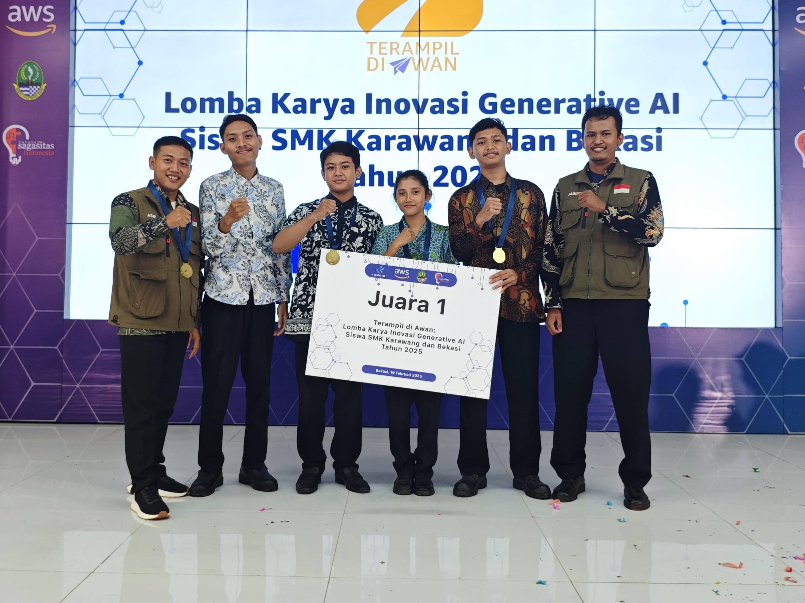

# Portfolio Enhancement Implementation Plan

> **For agentic workers:** Steps use checkbox (`- [ ]`) syntax for tracking.

**Goal:** Upgrade static portfolio with Projects section, working contact form, dark mode, animations

**Architecture:** Pure static HTML/CSS/JS with Bootstrap 5. CDN dependencies for AOS and Formspree. CSS custom properties for theming.

**Tech Stack:** HTML5, CSS3, Vanilla JS, Bootstrap 5, Font Awesome, AOS, Formspree

---

### Task 1: CSS — Variables, Dark Mode, New Component Styles

**Files:**
- Modify: `css/style.css`

- [ ] **Add CSS custom properties and dark mode overrides**

Add at the top of `css/style.css`:

```css
:root {
  --bg-primary: #ffffff;
  --bg-secondary: #f8f9fa;
  --bg-dark: #1a1e2c;
  --text-primary: #212529;
  --text-muted: #6c757d;
  --card-bg: #ffffff;
  --card-shadow: rgba(0,0,0,0.08);
  --section-bg-alt: #f8f9fa;
}

[data-theme="dark"] {
  --bg-primary: #121212;
  --bg-secondary: #1e1e1e;
  --text-primary: #e4e4e4;
  --text-muted: #aaaaaa;
  --card-bg: #1e1e1e;
  --card-shadow: rgba(0,0,0,0.4);
  --section-bg-alt: #1a1a1a;
}

body {
  background: var(--bg-primary);
  color: var(--text-primary);
  transition: background 0.3s, color 0.3s;
}

.bg-light {
  background: var(--section-bg-alt) !important;
}

.card {
  background: var(--card-bg) !important;
}

.text-muted {
  color: var(--text-muted) !important;
}
```

- [ ] **Add project card styles**

```css
/* Project Cards */
.project-card {
  border-radius: 16px;
  overflow: hidden;
  transition: transform 0.3s, box-shadow 0.3s;
  background: var(--card-bg);
}
.project-card:hover {
  transform: translateY(-6px);
  box-shadow: 0 12px 30px rgba(0,0,0,0.15);
}
.project-thumb {
  width: 100%;
  height: 200px;
  object-fit: cover;
  background: #e9ecef;
}
.project-thumb-placeholder {
  width: 100%;
  height: 200px;
  background: linear-gradient(135deg, #0d6efd22, #6610f222);
  display: flex;
  align-items: center;
  justify-content: center;
  font-size: 3rem;
  color: #0d6efd;
}
```

- [ ] **Add navbar shrink styles**

```css
.navbar {
  transition: padding 0.3s, background 0.3s;
}
.navbar.navbar-shrink {
  padding-top: 4px !important;
  padding-bottom: 4px !important;
  background: rgba(26,30,44,0.95) !important;
  backdrop-filter: blur(8px);
}
```

- [ ] **Add form feedback styles**

```css
.form-feedback {
  display: none;
  padding: 12px;
  border-radius: 8px;
  margin-top: 12px;
}
.form-feedback.show {
  display: block;
}
.form-feedback.success {
  background: #d1e7dd;
  color: #0f5132;
  border: 1px solid #badbcc;
}
.form-feedback.error {
  background: #f8d7da;
  color: #842029;
  border: 1px solid #f5c2c7;
}
```

- [ ] **Add AOS override for dark mode cards**

```css
[data-aos] {
  pointer-events: none;
}
[data-aos].aos-animate {
  pointer-events: auto;
}
```

- [ ] **Add dark mode toggle button style**

```css
.theme-toggle {
  background: none;
  border: 2px solid rgba(255,255,255,0.3);
  border-radius: 50%;
  width: 38px;
  height: 38px;
  display: flex;
  align-items: center;
  justify-content: center;
  color: #fff;
  cursor: pointer;
  transition: 0.3s;
  margin-left: 12px;
}
.theme-toggle:hover {
  border-color: #0d6efd;
  color: #0d6efd;
}
```

---

### Task 2: HTML — Dark Mode Toggle + Navbar Shrink + AOS CDN

**Files:**
- Modify: `index.html`

- [ ] **Add AOS CDN in `<head>`**

After Font Awesome link:
```html
<link href="https://unpkg.com/aos@2.3.1/dist/aos.css" rel="stylesheet">
```

- [ ] **Add theme toggle button in navbar**

In the navbar, after the `<ul>` closing tag and before `</div></nav>`:
```html
<button class="theme-toggle" id="themeToggle" aria-label="Toggle dark mode">
  <i class="fas fa-moon"></i>
</button>
```

- [ ] **Add AOS JS before closing `</body>`**

After Bootstrap JS:
```html
<script src="https://unpkg.com/aos@2.3.1/dist/aos.js"></script>
```

- [ ] **Add `data-aos` attributes to existing sections**

Each section's container div gets:
```html
<div class="container" data-aos="fade-up">
```

Sections to update: biodata, pendidikan, penghargaan, sertifikat, keahlian, pekerjaan, kontak

- [ ] **Update stat numbers to be dynamic (optional counter animation)**

Leave as-is for now (static numbers).

---

### Task 3: HTML — Projects Section

**Files:**
- Modify: `index.html`

- [ ] **Add new `#projects` section between Penghargaan and Sertifikat**

```html
<!-- Projects -->
<section id="projects" class="py-5">
  <div class="container" data-aos="fade-up">
    <h2 class="section-title text-center">Projects</h2>
    <div class="row g-4 mt-3">
      <div class="col-md-6 col-lg-4">
        <div class="card border-0 shadow h-100 project-card">
          <i class=\'fas fa-trash\'></i></div>'">
          <div class="card-body d-flex flex-column">
            <span class="badge bg-success align-self-start mb-2"><i class="fas fa-check-circle me-1"></i>Selesai</span>
            <h5 class="fw-bold">WMS — Waste Management System</h5>
            <p class="text-muted small flex-grow-1">Website informasi sampah terintegrasi dashboard IoT + AI chatbot berbasis AWS untuk memantau tong sampah real-time.</p>
            <div class="mb-2">
              <span class="badge bg-primary me-1">IoT</span>
              <span class="badge bg-success me-1">AWS</span>
              <span class="badge bg-info me-1">AI Chatbot</span>
              <span class="badge bg-warning text-dark me-1">Dashboard</span>
            </div>
            <a href="https://youtu.be/5tDj4ebZ5W0" target="_blank" class="btn btn-danger btn-sm mt-2"><i class="fab fa-youtube me-2"></i>Demo</a>
          </div>
        </div>
      </div>
      <div class="col-md-6 col-lg-4">
        <div class="card border-0 shadow h-100 project-card">
          <div class="project-thumb-placeholder"><i class="fas fa-code"></i></div>
          <div class="card-body d-flex flex-column">
            <span class="badge bg-secondary align-self-start mb-2">Coming Soon</span>
            <h5 class="fw-bold">Portfolio Website</h5>
            <p class="text-muted small flex-grow-1">Personal portfolio ini — dibangun dengan Bootstrap 5, dark mode, dan animasi scroll.</p>
            <div class="mb-2">
              <span class="badge bg-primary me-1">HTML</span>
              <span class="badge bg-dark me-1">CSS</span>
              <span class="badge bg-warning text-dark me-1">JavaScript</span>
            </div>
            <a href="#" class="btn btn-outline-primary btn-sm mt-2 disabled"><i class="fab fa-github me-2"></i>Source</a>
          </div>
        </div>
      </div>
      <div class="col-md-6 col-lg-4">
        <div class="card border-0 shadow h-100 project-card">
          <div class="project-thumb-placeholder"><i class="fas fa-lightbulb"></i></div>
          <div class="card-body d-flex flex-column">
            <span class="badge bg-secondary align-self-start mb-2">Coming Soon</span>
            <h5 class="fw-bold">Next Project</h5>
            <p class="text-muted small flex-grow-1">Project berikutnya sedang direncanakan. Stay tuned!</p>
            <div class="mb-2">
              <span class="badge bg-secondary me-1">TBD</span>
            </div>
            <a href="#" class="btn btn-outline-primary btn-sm mt-2 disabled"><i class="fas fa-external-link-alt me-2"></i>Lihat</a>
          </div>
        </div>
      </div>
    </div>
  </div>
</section>
```

- [ ] **Move project detail out of Penghargaan section**

Replace the Penghargaan card body with a simpler award-focused version:
```html
<div class="card border-0 shadow overflow-hidden">
  <div class="row g-0">
    <div class="col-md-4 d-flex align-items-center justify-content-center award-side">
      <div class="text-center text-white">
        <i class="fas fa-trophy fa-4x mb-3"></i>
        <h3 class="fw-bold mb-0">Juara 1</h3>
        <p class="mb-0">Cloud Computing</p>
      </div>
    </div>
    <div class="col-md-8">
      <div class="card-body p-4">
        <h4 class="card-title fw-bold">AWS x Yayasan Sagasitas</h4>
        <p class="text-muted mb-0">
          <i class="fas fa-medal text-warning me-2"></i>Juara 1 — Cloud Computing Competition
        </p>
        <p class="card-text mt-3">
          Meraih juara 1 dalam kompetisi cloud computing yang diselenggarakan oleh <strong>AWS</strong> dan <strong>Yayasan Sagasitas</strong> dengan project <em>Waste Management System (WMS)</em>.
        </p>
        <a href="#projects" class="btn btn-outline-primary"><i class="fas fa-arrow-right me-2"></i>Lihat Project</a>
      </div>
    </div>
  </div>
</div>
```

- [ ] **Update hero stats** — change "1 Project" to a link or keep as-is

---

### Task 4: HTML — Contact Form Functional

**Files:**
- Modify: `index.html`

- [ ] **Add Formspree action to form**

In the `<form>` tag, replace with:
```html
<form id="contactForm" action="https://formspree.io/f/your-form-id" method="POST">
```

- [ ] **Add hidden fields and honeypot**

After the opening `<form>` tag:
```html
<input type="hidden" name="_subject" value="Pesan baru dari Portfolio!">
<input type="text" name="_gotcha" style="display:none" tabindex="-1" autocomplete="off">
```

- [ ] **Add feedback div after form fields but before submit button**

```html
<div id="formFeedback" class="form-feedback"></div>
```

- [ ] **Add required attributes to inputs**

Add `required` to name, email, and textarea fields.

- [ ] **Add form submission JS**

In the existing `<script>` block, add:
```js
// Contact form
const contactForm = document.getElementById('contactForm');
if (contactForm) {
  contactForm.addEventListener('submit', async function(e) {
    e.preventDefault();
    const fb = document.getElementById('formFeedback');
    fb.className = 'form-feedback';
    fb.textContent = 'Mengirim...';
    fb.classList.add('show');
    try {
      const res = await fetch(this.action, {
        method: 'POST',
        body: new FormData(this),
        headers: { 'Accept': 'application/json' }
      });
      if (res.ok) {
        fb.className = 'form-feedback success show';
        fb.textContent = '✓ Pesan berhasil dikirim! Saya akan menghubungi Anda segera.';
        this.reset();
      } else {
        throw new Error('Gagal mengirim');
      }
    } catch {
      fb.className = 'form-feedback error show';
      fb.textContent = '✗ Gagal mengirim pesan. Silakan coba lagi atau kirim langsung ke wegapangestuu@gmail.com.';
    }
  });
}
```

---

### Task 5: JS — Dark Mode Logic, Navbar Shrink, AOS Init

**Files:**
- Modify: `index.html` (within `<script>` block)

- [ ] **Replace existing script block with complete JS**

```js
// Active nav link on scroll
const navLinks = document.querySelectorAll('.navbar-nav .nav-link');
const sections = document.querySelectorAll('section[id]');

function updateActiveLink() {
  let current = '';
  sections.forEach(s => {
    const top = s.offsetTop - 100;
    if (window.scrollY >= top) current = s.id;
  });
  navLinks.forEach(a => {
    a.classList.toggle('active', a.getAttribute('href') === '#' + current);
  });
}

window.addEventListener('scroll', updateActiveLink);
window.addEventListener('load', updateActiveLink);

// Dark mode toggle
const themeToggle = document.getElementById('themeToggle');
const themeIcon = themeToggle?.querySelector('i');

function setTheme(theme) {
  document.documentElement.setAttribute('data-theme', theme);
  localStorage.setItem('theme', theme);
  if (themeIcon) {
    themeIcon.className = theme === 'dark' ? 'fas fa-sun' : 'fas fa-moon';
  }
}

themeToggle?.addEventListener('click', () => {
  const current = document.documentElement.getAttribute('data-theme');
  setTheme(current === 'dark' ? 'light' : 'dark');
});

// Load saved theme
const savedTheme = localStorage.getItem('theme') || 'light';
setTheme(savedTheme);

// Navbar shrink
const navbar = document.querySelector('.navbar');
window.addEventListener('scroll', () => {
  navbar?.classList.toggle('navbar-shrink', window.scrollY > 80);
});

// AOS init
AOS.init({
  duration: 800,
  once: true,
  offset: 100
});

// Contact form
const contactForm = document.getElementById('contactForm');
if (contactForm) {
  contactForm.addEventListener('submit', async function(e) {
    e.preventDefault();
    const fb = document.getElementById('formFeedback');
    fb.className = 'form-feedback';
    fb.textContent = 'Mengirim...';
    fb.classList.add('show');
    try {
      const res = await fetch(this.action, {
        method: 'POST',
        body: new FormData(this),
        headers: { 'Accept': 'application/json' }
      });
      if (res.ok) {
        fb.className = 'form-feedback success show';
        fb.textContent = '✓ Pesan berhasil dikirim! Saya akan menghubungi Anda segera.';
        this.reset();
      } else {
        throw new Error('Gagal mengirim');
      }
    } catch {
      fb.className = 'form-feedback error show';
      fb.textContent = '✗ Gagal mengirim pesan. Silakan coba lagi atau kirim langsung ke wegapangestuu@gmail.com.';
    }
  });
}
```
